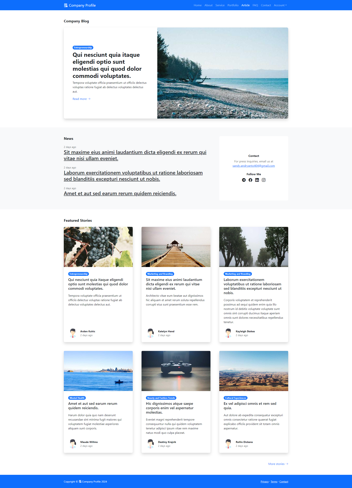

# Company Profile Website

<p>
   This profile website serves as a communication medium between a company and external parties such as clients, readers, or other users. 
</p>
<p>
	This website is a specialized digital platform that serves the purpose of introducing a company to its visitors or readers. 
</p>
<p>
	This kind of directory aims to provide specific information about the company's brand, such as its vision, mission, values, products or services, and even historical background.
</p> 

# Preview


# Features

<ol type="1">
	<li>
		Authentication
		<ol type="1">
			<li>Login</li>
			<li>Register</li>
			<li>Forgot Password</li>
			<li>Reset Password</li>
		</ol>
	</li>
	<li>
		Account Management
		<ol type="1">
			<li>Change Password</li>
			<li>Manage Profile</li>
		</ol>
	</li>
	<li>
		General Page
		<ol type="1">
			<li>Home</li>
			<li>About</li>
			<li>Service</li>
			<li>Portfolio</li>
			<li>Article</li>
			<li>FAQ</li>
			<li>Contact</li>
		</ol>
	</li>
</ol>

# Technologies Used

<ol type="1">
	<li>Visual Studio 2022</li>
	<li>Modern Web Browser</li>
	<li>Git 2.4</li>
	<li>
		Backend Technologies
		<ol type="1">
			<li>Postgre SQL 13/li>
			<li>C#</li>
			<li>Microsoft Entity Framework Core 8.0.3</li>
			<li>.NET Core 8 </li>
		</ol>
	</li>
	<li>
		Frontend Technologies
		<ol type="1">
			<li>CSS3</li>
			<li>HTML5</li>
			<li>Bootstrap 5</li>
			<li>Node JS 20</li>
			<li>Angular JS 17</li>
		</ol>
	</li>
</ol>

## Getting Started
#### 1. Clone the repository and navigate to the directory
```shell
git clone https://github.com/sandyandryanto404/company-profile-netcore.git
cd company-profile-netcore
```

#### 2. Install backend dependencies, please move to directory company-profile-netcore/backend
```shell
dotnet restore
```

#### 3. Customize settings in appsettings.json
```shell
"MainContext": "Host=localhost;Database=db_name;Username=db_username;Password=db_password"
```

#### 4. Start PostgreSQL Service , Seed data and Running REST API
```shell
sudo service postgresql start
createdb {database-name}
dotnet ef database update
dotnet run --urls="http://0.0.0.0:8000"
```

#### 5. Install frontend dependencies, please move to directory company-profile-netcore/frontend
```shell
npm install
```

#### 6. Make a environment.development.ts file in company-profile-netcore/frontend/src/environments and customize its settings 
```shell
export const environment = {
    production: false,
    title: 'My Website',
    backendURL: 'http://localhost:8000'
};

```

#### 7. Run Application 
```shell
cd frontend
npm start
```

#### 8. Access application by entering [https://localhost:4200](https://localhost:4200) in the browser.

<br/>

</br>


#### 9. Developer Contact
<ul>
	<li>
		<strong>Linked In</strong> <a target="_blank" href="https://www.linkedin.com/in/sand404/">https://www.linkedin.com/in/sand404/</a>
	</li>
	<li>
		<strong>Facebook</strong> <a target="_blank" href="https://www.facebook.com/sandyandryantz">https://www.facebook.com/sandyandryantz</a>
	</li>
	<li>
		<strong>Instagram</strong> <a target="_blank" href="https://www.instagram.com/sandyandryanto/">https://www.instagram.com/sandyandryanto/</a>
	</li>
	<li>
		<strong>Telegram</strong> <a target="_blank" href="https://t.me/sand404">https://t.me/sand404</a>
	</li>
	<li>
		<strong>Gmail</strong> <a  href="mailto:sandy.andryanto404@gmail.com">sandy.andryanto404@gmail.com</a>
	</li>
</ul>